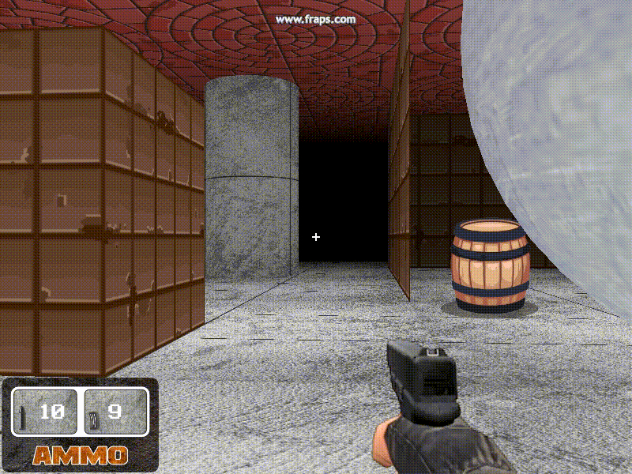

<h1 align="center">FPP Retro Engine</h1>

> **Drawing 3D Perspective & Texture Drawing Function with D3D Wrapper**

<p align="center">

</p>

---

# Overview

**FPP Retro Engine** adalah engine **buatan saya sendiri**. Konsep 3D sederhana yang meniru gaya **GameMaker 8.1** untuk menggambar dunia 3D dengan perspektif, termasuk lantai, dinding, blok, dan objek 3D lain dengan tekstur. Engine ini menggunakan kombinasi **GLUT + OpenGL** untuk rendering dan **stb_image** untuk memuat tekstur.

Cocok untuk membuat demo FPS retro, prototyping game 3D sederhana, atau belajar konsep rendering 3D.

---

# Example: Shooting Engine

<p align="center">

</p>

---

# Features

* **3D Perspective Rendering**
  Rendering dunia 3D berbasis perspektif menggunakan OpenGL/GLUT.

* **Texture Loading**
  Memuat tekstur dari file PNG, JPG, atau BMP dengan library `stb_image`.

* **D3D Wrapper**
  Wrapper yang meniru fungsi-fungsi **GameMaker 8.1 D3D** untuk menggambar lantai, dinding, blok, dan bentuk 3D lainnya.

* **Lightweight & Simple**
  Cocok untuk belajar 3D rendering tanpa engine besar seperti Unity atau Unreal.

---

# D3D Functions

Semua fungsi tersedia di folder `src/wrapper/d3d.h`:

### **3D Rendering**
| Function             | Description                                        | Parameters                                                        |
| -------------------- | -------------------------------------------------- | ----------------------------------------------------------------- |
| `d3d_draw_floor`     | Menggambar lantai horizontal.                      | `x1, y1, z1, x2, y2, z2, tex, hrepeat, vrepeat`                   |
| `d3d_draw_wall`      | Menggambar dinding vertikal.                       | `x1, y1, z1, x2, y2, z2, tex, hrepeat, vrepeat, rotationZ`        |
| `d3d_draw_wall_rot`  | Menggambar dinding vertikal dengan rotasi derajat. | `x1, y1, z1, x2, y2, z2, tex, hrepeat, vrepeat, rotationZDeg`     |
| `d3d_draw_block`     | Menggambar blok 3D (6 sisi) dengan tekstur.        | `x1, y1, z1, x2, y2, z2, tex, hrepeat, vrepeat`                   |
| `d3d_draw_cylinder`  | Menggambar silinder dengan tekstur.                | `x1, y1, z1, x2, y2, z2, tex, hrepeat, vrepeat, closed, steps`    |
| `d3d_draw_ellipsoid` | Menggambar ellipsoid atau bola dengan tekstur.     | `x1, y1, z1, x2, y2, z2, tex, hrepeat, vrepeat, steps`            |

### **Collision Detection**
| Function                  | Description                                | Parameters                                     |
| ------------------------- | ------------------------------------------ | ---------------------------------------------- |
| `d3d_collision_block`     | Mengecek tabrakan dengan blok.             | `px, py, pz, pr, x1, y1, z1, x2, y2, z2`       |
| `d3d_collision_cylinder`  | Mengecek tabrakan dengan silinder.         | `px, py, pz, pr, x1, y1, z1, x2, y2, z2`       |
| `d3d_collision_ellipsoid` | Mengecek tabrakan dengan ellipsoid / bola. | `px, py, pz, pr, x1, y1, z1, x2, y2, z2`       |

---

# Audio Manager

Fungsi audio menggunakan SDL2_mixer, tersedia di `src/wrapper/audio.hpp`:

| Function                    | Description                           | Parameters                                     |
| --------------------------- | ------------------------------------- | ---------------------------------------------- |
| `Audio::Manager::init`      | Inisialisasi sistem audio.            | `frequency, format, channels, chunksize`       |
| `Audio::Manager::playSound` | Memutar efek suara (WAV/OGG).         | `path, loops`                                  |
| `Audio::Manager::playMusic` | Memutar musik latar (looping).        | `path, loop`                                   |
| `Audio::Manager::stopMusic` | Menghentikan musik yang sedang jalan. | -                                              |

---

# Font & Text Rendering

Mendukung font TrueType (.ttf) menggunakan `stb_truetype`, tersedia di `src/wrapper/font.hpp`:

| Function     | Description                        | Parameters                    |
| ------------ | ---------------------------------- | ----------------------------- |
| `loadFont`   | Memuat file font .ttf.             | `font, filename, pixelHeight` |
| `renderText` | Menggambar teks ke layar (GUI/HUD). | `font, x, y, text, windowH`   |

---

# Utility & Asset Loading

| Function           | Description                                    | Parameters                                     |
| ------------------ | ---------------------------------------------- | ---------------------------------------------- |
| `loadTexture`      | Memuat file gambar menjadi OpenGL Texture ID.  | `filename`                                     |
| `getAssets`        | Mendapatkan path lengkap ke folder assets.     | `filename`                                     |
| `drawTexturedQuad` | Menggambar quad 2D dengan tekstur (HUD/UI).    | `textureID, x, y, width, height`               |
| `draw3DQuad`       | Menggambar quad 3D di dunia (Sprite/Billboard). | `textureID, x, y, z, size, rotation, angle`    |

---

# Installation / Build

1. Clone repo:

```bash
git clone https://github.com/yohanesokta/GL-FPS.git
cd GL-FPS
```

2. Buat folder build dan compile:

```bash
mkdir build
cd build
cmake ..
make
```

3. Jalankan demo:

```bash
./main
```

---

# Dependencies

* **CMake** ≥ 3.20
* **OpenGL**
* **GLUT / FreeGLUT**
* **SDL2 & SDL2_mixer** (Untuk Audio)
* **stb_image & stb_truetype** (included)
* Compiler: GCC/Clang/Visual Studio

---

# Usage

Contoh penggunaan fungsi dasar di `main.cpp`:

```cpp
// Load Tekstur
GLuint wallTex = loadTexture(getAssets("/wall2.png"));

// Di dalam loop render (drawWorld):
// Lantai
d3d_draw_floor(0, 0, 0, 100, 0, 100, wallTex, 10, 10);

// Dinding
d3d_draw_wall(0, 0, 0, 0, 50, 100, wallTex, 5, 10);

// Blok 3D
d3d_draw_block(20, 0, 20, 30, 10, 30, wallTex, 1, 1);

// Play Sound
Audio::Manager::playSound(getAssets("/sound/shoot-p.wav"));
```

---

# Notes

* Engine ini **tidak menggunakan shading modern** (hanya fixed-function OpenGL).
* Menggunakan **GameMaker 8.1 D3D Style** untuk kemudahan prototyping.
* Koordinat menggunakan sistem **Right-Handed Coordinate System**.